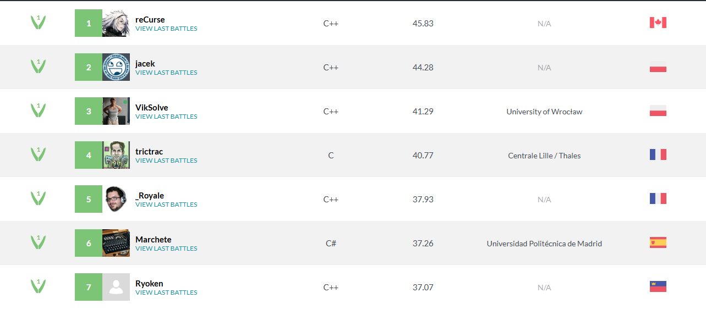

# DeepVik - English Draughts (Checkers) Engine & Bot 🤖

> **Note:** This project is actively **in development**. The engine is constantly being improved with the goal of reaching the top of the leaderboard!

Welcome to the DeepVik repository – my custom engine and bot for English draughts (checkers). This project was born from a passion for algorithms and optimization, with the goal of reaching the absolute top in bot programming competitions.

Currently, DeepVik is ranked **3rd worldwide** and **2nd in Poland** on the CodinGame platform. Notably, it achieves this high rank competing against neural network-based opponents without using any neural networks itself! DeepVik's strength lies in pure, brutally optimized search algorithms and heuristics.

### 🏆 [Global Leaderboard on CodinGame](https://www.codingame.com/multiplayer/bot-programming/checkers/leaderboard)
The goal is simple: claim first place!

---

## How It Works 🧠

The core of the engine is a **bitboard** implementation, a board representation optimized for high-speed bitwise operations. The main search algorithm is **minimax with iterative deepening**, supercharged by a range of advanced techniques:

* **Alpha-Beta Pruning**: Drastically reduces the number of nodes to be evaluated in the search tree.
* **Transposition Table**: Caches previously analyzed positions to avoid re-computing them.
* **Advanced Evaluation Function**: Analyzes positions based on piece count, kings, positional advantages, and board control.
* **Move Ordering Heuristics**:
    * **Killer-Move Heuristic**: Prioritizes moves that have proven effective at the same depth in other branches of the tree.
    * **Hash-Move Ordering**: Checks the best move from the transposition table first.
* **Cache Optimizations**: Data structures and algorithms are designed to maximize CPU cache efficiency.

It's worth mentioning that the CodinGame platform imposes a strict **100ms time limit per move** and compiles C++ code with the `-O0` flag (no optimizations). This constraint forced manual, extreme optimization of every piece of code, sometimes at the expense of readability.

---

## Play Against DeepVik! ⚔️

Want to test your skills against a top-ranked bot? You have two options!

### 1. Desktop App (Qt/C++)

I've created a simple desktop application that allows you to play directly against the DeepVik engine.

**App Features:**
* **Color Selection**: You can play as either White or Black.
* **Adjustable Difficulty**: Set the bot's search depth to adjust its playing strength.
* **Evaluation Bar**: See a live analysis of who has the advantage according to the engine.

**How to Launch:**
* 🖥️ **Windows**: Navigate to the `WinApp` folder and run `DeepVik.exe`. That's it!
* 🐧 **Linux / macOS**: Open a terminal in the project's root directory and run the command: `bash build.sh`.

### 2. Challenge Your Own Bot on CodinGame!

If you're developing your own draughts bot, you can benchmark it against DeepVik directly in the CodinGame arena. It's the best way to test its strength!

🔗 **Challenge Link:** **[https://www.codingame.com/ide/puzzle/checkers](https://www.codingame.com/ide/puzzle/checkers)**

---

## Future Plans 🚀

The project is still in active development. The main goal for the near future is:
* **Implement an Opening Book**: To ensure an even stronger start in the early phase of the game.